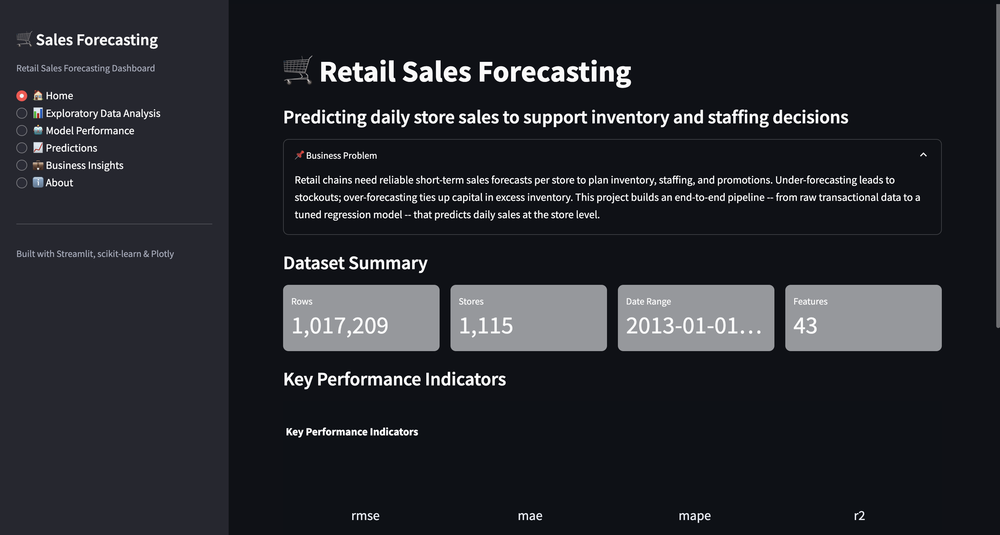
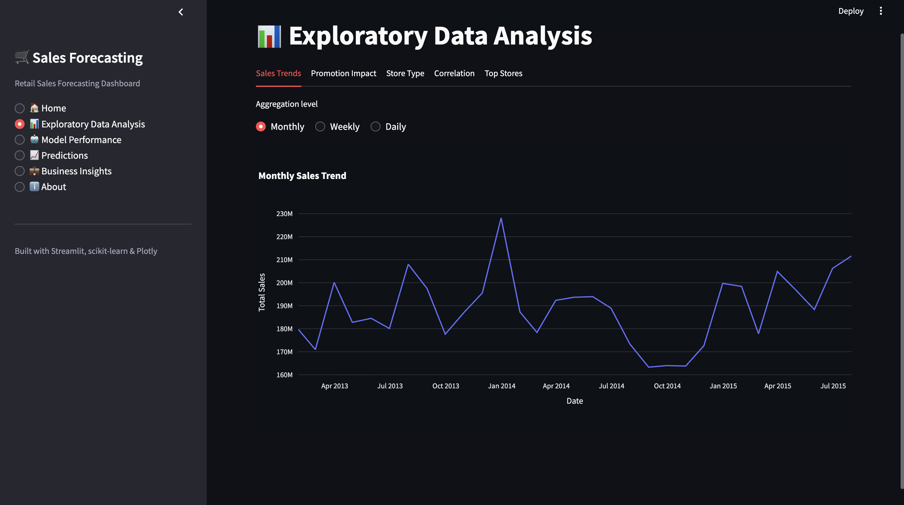
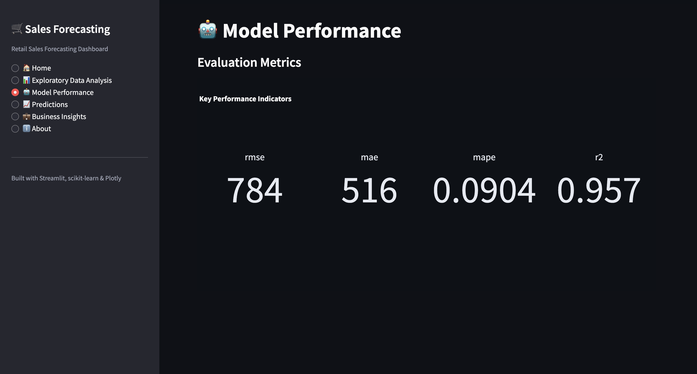
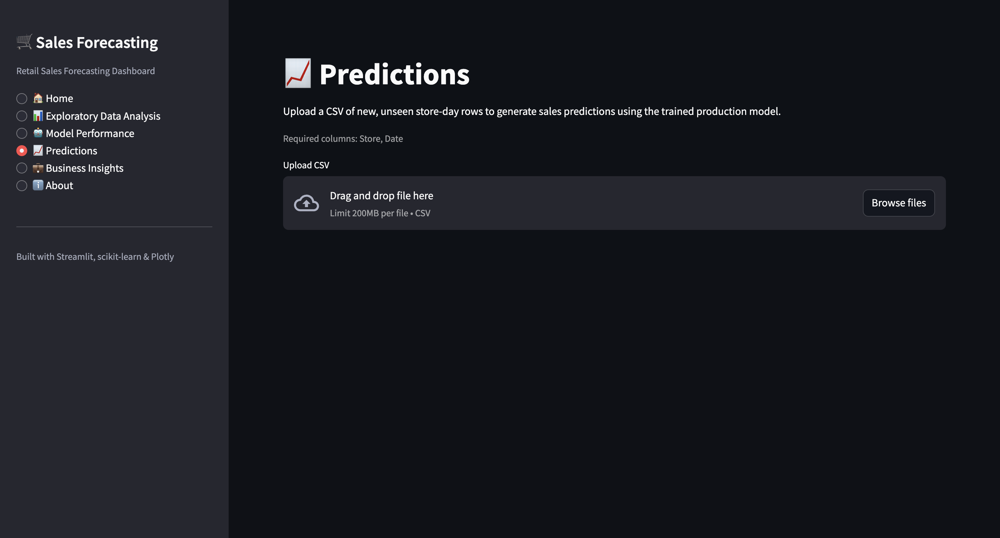
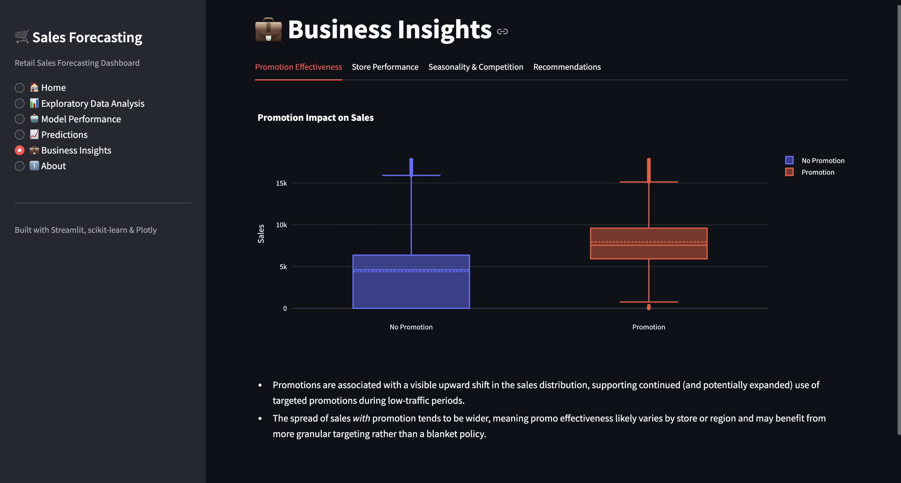

# 📊 Retail Inventory Demand Forecasting & Business Analytics

[]()
[]()
[]()
[]()

An end-to-end Machine Learning and Business Analytics project that forecasts retail store sales and transforms predictions into actionable business insights through an interactive Streamlit dashboard.

Unlike notebook-centric projects, this repository follows a modular, production-inspired architecture with separate data, feature engineering, modeling, visualization, and application layers.

---

# 📌 Project Overview

Retail businesses constantly struggle with two major challenges:

- Overstocking products, leading to increased storage costs and markdowns.
- Understocking products, resulting in lost sales and poor customer experience.

This project develops an end-to-end demand forecasting system capable of predicting store-level daily sales while providing business stakeholders with interactive analytics for inventory planning and decision-making.

The project covers the complete machine learning lifecycle:

- Data Loading
- Data Cleaning
- Feature Engineering
- Model Training
- Hyperparameter Tuning
- Model Evaluation
- Sales Prediction
- Interactive Business Dashboard

---

# 📂 Dataset

**Dataset:** Rossmann Store Sales (Kaggle)

The Rossmann dataset was selected because it closely resembles real-world retail forecasting problems by combining:

- Daily historical sales
- Promotional campaigns
- School & state holidays
- Competition information
- Store metadata

### Dataset Statistics

| Metric | Value |
|---------|------:|
| Daily Sales Records | **1,017,209** |
| Retail Stores | **1,115** |
| Engineered Features | **43** |
| Forecast Target | Daily Store Sales |

---

# 🛠 Tech Stack

| Layer | Technologies |
|--------|--------------|
| Programming | Python |
| Data Processing | Pandas, NumPy |
| Machine Learning | Scikit-learn |
| Model Persistence | Joblib |
| Visualization | Plotly, Matplotlib |
| Dashboard | Streamlit |

---

# 🏗 Project Architecture

```text
Raw Data
     │
     ▼
Data Loading
     │
     ▼
Data Merging
     │
     ▼
Data Cleaning
     │
     ▼
Feature Engineering
     │
     ▼
Model Training
     │
     ▼
Hyperparameter Tuning
     │
     ▼
Model Evaluation
     │
     ▼
Prediction Pipeline
     │
     ▼
Interactive Streamlit Dashboard
```

---

# 📁 Repository Structure

```text
Retail-Inventory-Forecast/

│
├── app.py
├── README.md
├── requirements.txt
│
├── src/
│   ├── config.py
│   ├── data/
│   ├── features/
│   ├── models/
│   └── visualization/
│
├── models/
│   └── trained/
│
├── reports/
│   └── figures/
│
├── notebooks/
│
└── data/
    ├── raw/
    ├── interim/
    ├── processed/
    └── external/
```

---

# ⚙️ Feature Engineering

The pipeline automatically creates meaningful time-series features, including:

### Calendar Features

- Year
- Month
- Week
- Day
- Weekday

### Lag Features

- Previous Day Sales
- 7-Day Lag
- 14-Day Lag
- 30-Day Lag

### Rolling Statistics

- 7-Day Rolling Mean
- 30-Day Rolling Mean
- Rolling Standard Deviation

### Business Features

- Competition Duration
- Promotion Duration
- Promotional Month Indicator

### Additional Features

- Cyclical Date Encoding
- Log-transformed Sales Target

---

# 🤖 Machine Learning Pipeline

The project compares multiple regression models before selecting the best-performing model.

### Models Evaluated

- Baseline Mean Regressor
- Linear Regression
- Random Forest Regressor
- HistGradientBoosting Regressor

Hyperparameter tuning is performed using **RandomizedSearchCV**, and models are evaluated using a time-based train-validation split suitable for forecasting problems.

---

# 📈 Model Evaluation

The trained models are evaluated using multiple regression metrics:

- RMSE (Root Mean Squared Error)
- MAE (Mean Absolute Error)
- MAPE (Mean Absolute Percentage Error)
- R² Score

The project also generates:

- Actual vs Predicted Plot
- Residual Plot
- Residual Distribution

These visualizations help assess both predictive accuracy and model reliability.

---

# 📊 Dashboard Features

The Streamlit dashboard provides:

- 📈 Sales Forecasting
- 📊 Exploratory Data Analysis
- 📉 Model Performance Metrics
- 🏬 Store-level Analytics
- 📋 Business Insights
- 📥 Prediction Interface

---

# 🖼 Dashboard Preview

<<<<<<< HEAD
> *(Screenshots will be added here.)*
=======
## 🏠 Home



---

## 📊 Exploratory Data Analysis



---

## 📈 Model Performance



---

## 📉 Predictions



---

## 💼 Business Insights


>>>>>>> b27b1ac (Improve README and add dashboard screenshots)

Suggested screenshots:

- Home Dashboard
- Exploratory Data Analysis
- Model Performance
- Prediction Page
- Business Insights

---

# 📌 Project Status

| Component | Status |
|------------|--------|
| Data Loading | ✅ |
| Data Cleaning | ✅ |
| Feature Engineering | ✅ |
| Model Training | ✅ |
| Hyperparameter Tuning | ✅ |
| Model Evaluation | ✅ |
| Prediction Pipeline | ✅ |
| Streamlit Dashboard | ✅ |
| GitHub Repository | ✅ |
| Deployment | 🔄 Planned |

---

# 🚀 Installation

Clone the repository

```bash
git clone https://github.com/thepoojashinde/Retail-Inventory-Forecast.git
```

Move into the project

```bash
cd Retail-Inventory-Forecast
```

Create a virtual environment

```bash
python -m venv .venv
```

Activate it

### macOS / Linux

```bash
source .venv/bin/activate
```

### Windows

```bash
.venv\Scripts\activate
```

Install dependencies

```bash
pip install -r requirements.txt
```

---

# 📂 Dataset Setup

Download the **Rossmann Store Sales** dataset from Kaggle and place:

- `train.csv`
- `store.csv`
- `test.csv`

inside:

```text
data/raw/
```

The remaining datasets are automatically generated by the pipeline.

---

# ▶️ Running the Project

### Train the model

```bash
python -m src.models.train_model
```

### Evaluate the model

```bash
python -m src.models.evaluate_model
```

### Generate predictions

```bash
python -m src.models.predict_model --input data/processed/featured_data.csv
```

### Launch the dashboard

```bash
streamlit run app.py
```

---

# 💼 Business Value

This project demonstrates how machine learning can support retail decision-making by enabling:

- Accurate sales forecasting
- Better inventory planning
- Reduced stock shortages
- Lower overstock costs
- Promotion effectiveness analysis
- Store-level performance monitoring

---

# 🚀 Future Improvements

Potential future enhancements include:

- XGBoost and LightGBM model comparison
- Deep Learning forecasting (LSTM)
- Automated retraining pipeline
- Cloud deployment
- Docker support
- CI/CD integration
- REST API for real-time forecasting

---

# 👩‍💻 Author

## Pooja Shinde

**B.Tech Computer Science Engineering**

Maulana Azad National Institute of Technology (MANIT), Bhopal

GitHub:
https://github.com/thepoojashinde

---

⭐ If you found this project useful, consider giving it a star!
